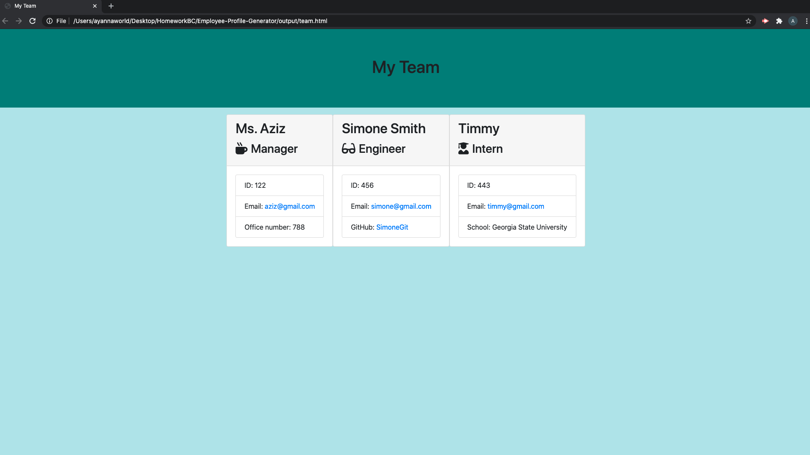

# 
 Employee Profile Generator 

## Description
The Employee Profile Generator is a node.js CLI that takes in information about employees and generates an HTML webpage that displays summaries for each person. The application uses the inquirer npm package to create this CLI tool, receives user input, and easily generates an employee card. The application initially asks the user for their employee type, giving an option between Manager, Engineer, or Intern. Depending on their response, they are prompted to answer a series of questions. Using the answers provided, an employee card is generated and displayed in an HTML page. 

## Table of Contents
* [Description](#Description)
* [Built With](#built-with)
* [Demo](#demo)
* [Authors](#authors)
* [License](#license)

## Built With
* HTML
* CSS
* Javascript
* Node.js

## Demo
Click this link into your browser to see the video demo of this application.

* <iframe src="https://drive.google.com/file/d/12iG10Xl-rw5yni9vJyQ6nz5ga9TxpBNW/preview" width="640" height="480"></iframe>

* Screenshot of application 

## Authors
Alma Aziz

## MIT License

Copyright (c) 2021 Ayanna Aziz

Permission is hereby granted, free of charge, to any person obtaining a copy
of this software and associated documentation files (the "Software"), to deal
in the Software without restriction, including without limitation the rights
to use, copy, modify, merge, publish, distribute, sublicense, and/or sell
copies of the Software, and to permit persons to whom the Software is
furnished to do so, subject to the following conditions:

The above copyright notice and this permission notice shall be included in all
copies or substantial portions of the Software.

THE SOFTWARE IS PROVIDED "AS IS", WITHOUT WARRANTY OF ANY KIND, EXPRESS OR
IMPLIED, INCLUDING BUT NOT LIMITED TO THE WARRANTIES OF MERCHANTABILITY,
FITNESS FOR A PARTICULAR PURPOSE AND NONINFRINGEMENT. IN NO EVENT SHALL THE
AUTHORS OR COPYRIGHT HOLDERS BE LIABLE FOR ANY CLAIM, DAMAGES OR OTHER
LIABILITY, WHETHER IN AN ACTION OF CONTRACT, TORT OR OTHERWISE, ARISING FROM,
OUT OF OR IN CONNECTION WITH THE SOFTWARE OR THE USE OR OTHER DEALINGS IN THE
SOFTWARE.